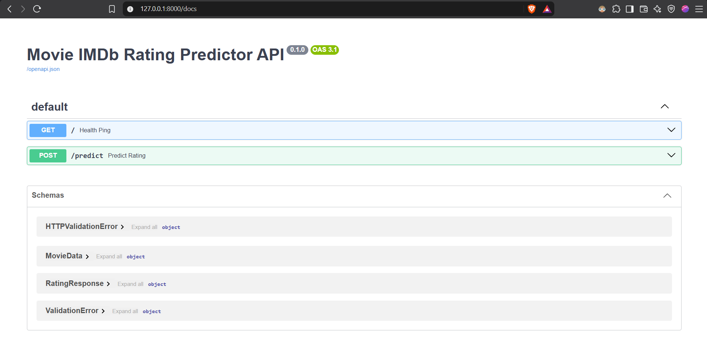
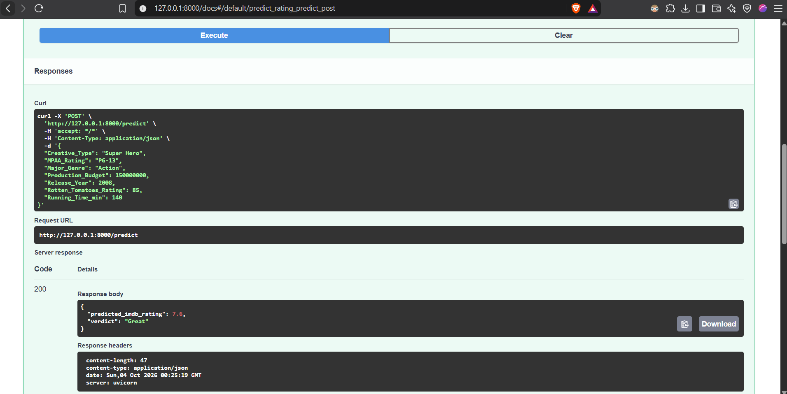

# FastAPI Lab – Movie IMDb Rating Predictor

Modified version of the FastAPI lab.

**Changes from the original lab**
- Task: classification → **regression** (predicting a movie's IMDb rating, 1–10)
- Dataset: Iris → **Vega Movies dataset** (~3,200 movies with budget, runtime, genre, MPAA rating, critics score)
- Handles messy real-world data: missing values and text (categorical) columns
- Model: Decision Tree → **scikit-learn Pipeline** (imputation + one-hot encoding + HistGradientBoostingRegressor), saved as one file so the API takes raw inputs
- Evaluation with R² and mean absolute error
- Input validation on `/predict` (e.g. critics score 0–100, positive budget)
- Response includes a plain-language verdict (Great / Good / Average / Poor)
- Model is loaded once and cached instead of on every request

## Project structure
```
Fast_API
├── model/            # movie_model.pkl is created here by train.py
├── src/
│   ├── __init__.py
│   ├── data.py       # downloads the dataset and picks features
│   ├── train.py      # builds the pipeline, trains, evaluates, saves
│   ├── predict.py    # loads the model and predicts
│   └── main.py       # FastAPI app
├── README.md
└── requirements.txt
```

## Setup
```bash
python -m venv fastapi_lab_env
fastapi_lab_env\Scripts\activate      # Mac/Linux: source fastapi_lab_env/bin/activate
pip install -r requirements.txt
```

## Train
```bash
cd src
python train.py
```
The dataset is downloaded from the Vega datasets CDN each time you train (needs internet).

## Run the API
```bash
uvicorn main:app --reload
```
Open http://127.0.0.1:8000/docs and try `POST /predict`.

## Features
| Feature | Meaning |
|---|---|
| Production_Budget | Budget in US dollars |
| Running_Time_min | Runtime in minutes |
| Rotten_Tomatoes_Rating | Critics score, 0–100 |
| Release_Year | Year of release |
| Major_Genre | e.g. Action, Comedy, Drama, Horror |
| MPAA_Rating | e.g. G, PG, PG-13, R |
| Creative_Type | e.g. Contemporary Fiction, Science Fiction, Super Hero |

## Example request
```json
{
  "Production_Budget": 150000000, "Running_Time_min": 140,
  "Rotten_Tomatoes_Rating": 85, "Release_Year": 2008,
  "Major_Genre": "Action", "MPAA_Rating": "PG-13", "Creative_Type": "Super Hero"
}
```
Example response: `{"predicted_imdb_rating": 7.4, "verdict": "Good"}` (exact value depends on training)


